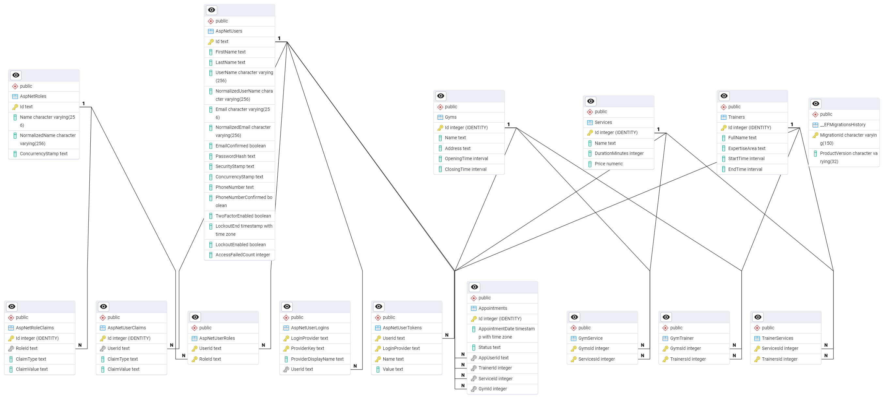
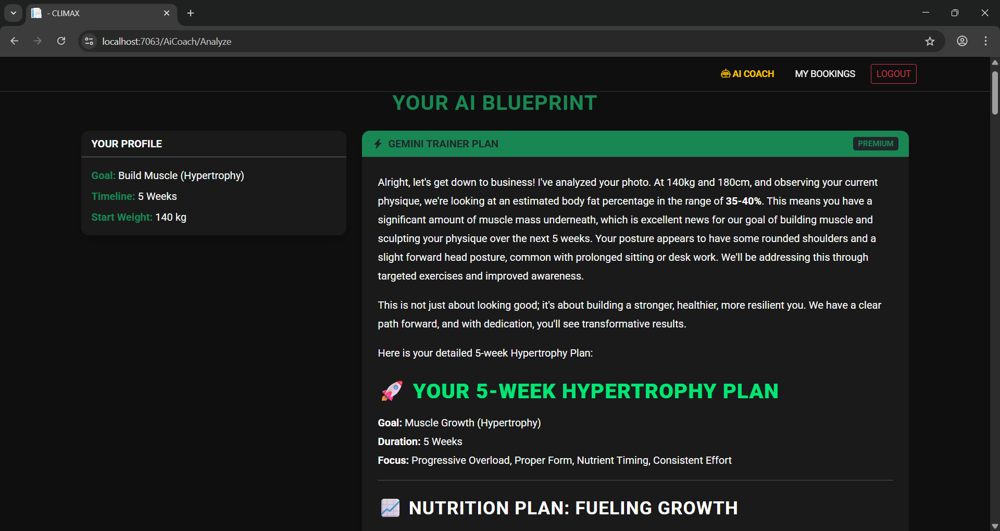
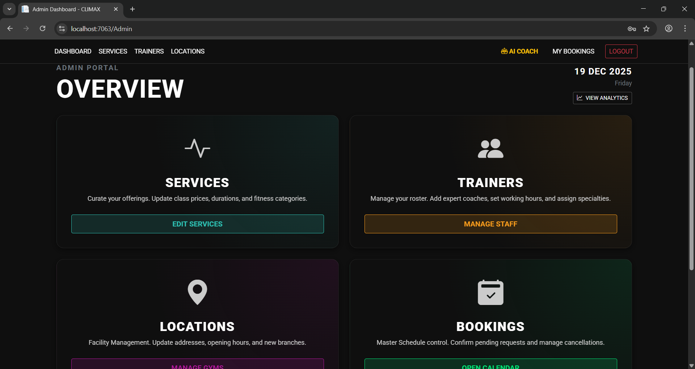
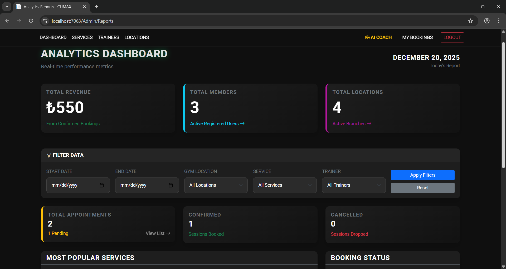
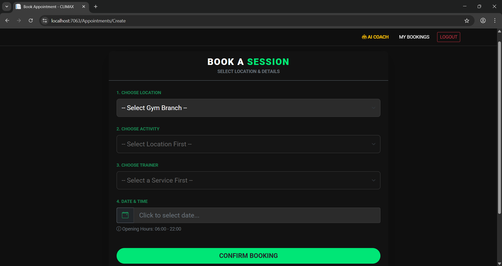
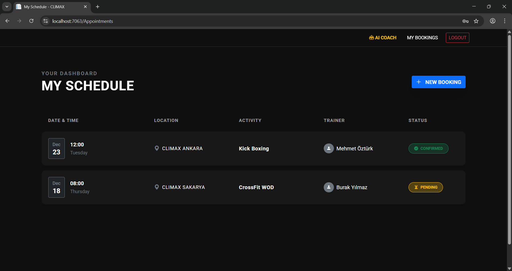

# CLIMAX FITNESS - Intelligent Gym Management System

   

## Project Overview
**Climax Fitness** is a comprehensive web application designed to digitize operations for modern fitness centers. Developed as the final project for the **2025-2026 Web Programming Course**, this system bridges the gap between gym management and member experience.

It features a robust backend for scheduling and resource management, combined with an AI-powered coaching module that provides personalized workout plans and physique visualization text based on user data.

---

## Key Features

### 1. Gym & Resource Management
* **Multi-Branch Support:** Manage multiple gym locations with specific operating hours.
* **Service Catalog:** Configure fitness services (e.g., Pilates, HIIT, Personal Training) with duration and pricing.
* **Trainer Assignment:** Map trainers to specific gyms and expertise areas (Many-to-Many relationships).

### 2. Smart Appointment System
* **Availability Logic:** Real-time checking of trainer schedules to prevent double-booking.
* **Dark Mode UI:** Integrated **Flatpickr** for a sleek, user-friendly date and time selection experience.
* **Validation:** Strict server-side validation to ensure bookings fall within opening hours.

### 3. AI Coaching (Gemini 2.5 Integration)
* **Physique Analysis:** Users upload a photo, and the AI (Google Gemini 2.5 Flash) analyzes body composition and posture.
* **Custom Plans:** Generates a detailed, week-by-week diet and workout routine based on the user's goal (Cut, Bulk, Maintenance).
* **Future Visualization:** Provides a vivid, AI-generated text description and an image visualizing the user's future physique to drive motivation.

### 4. Admin Dashboard & Analytics
* **REST API Reporting:** Charts are powered by a custom internal API (`/Admin/GetServicePopularityData`) that aggregates data dynamically.
* **Live Filtering:** Admins can filter reports by Date Range, Gym Location, and Trainer using LINQ queries.
* **Visual Data:** Interactive charts (Chart.js) showing revenue, appointment status, and service popularity.

---

## Technology Stack

* **Backend:** ASP.NET Core 8.0 MVC
* **Language:** C#
* **Data Access:** Entity Framework Core (Code-First)
* **Database:** PostgreSQL
* **Frontend:** HTML5, CSS3, Bootstrap 5, JavaScript (jQuery)
* **UI Libraries:** Flatpickr (Time/Date), Chart.js (Analytics)
* **AI Service:** Google Gemini API

---

## Default Credentials (Seed Data)

The application comes pre-seeded with an Administrator account for testing and grading purposes:

| Role | Email | Password |
| :--- | :--- | :--- |
| **Admin** | `b221210591@sakarya.edu.tr` | `sau` |

---

## Database Model

The system utilizes a relational database model with the following core entities:
* **Gyms:** Stores location data and operating hours.
* **Trainers:** Stores staff details and expertise.
* **Services:** Stores available workout types.
* **Appointments:** Transactional table linking Users, Trainers, and Services.
* **GymTrainer / GymService:** Junction tables handling many-to-many relationships.

---

## Screenshots

### 1. Home & AI Coach
| Home Page | AI Analysis Result |
| :---: | :---: |
|  |  |

### 2. Admin Panel & Reporting
| Dashboard Analytics | Filtered Reports |
| :---: | :---: |
|  |  |

### 3. Booking System
| Date/Time Selection | Booking Confirmation |
| :---: | :---: |
|  |  |

---

## Author Info

**Name:** Mahfuz AHMAD
**Student ID:** B221210591
**Department:** Computer Engineering
**University:** Sakarya University
**Course:** Web Programming (Fall 2025-2026)
