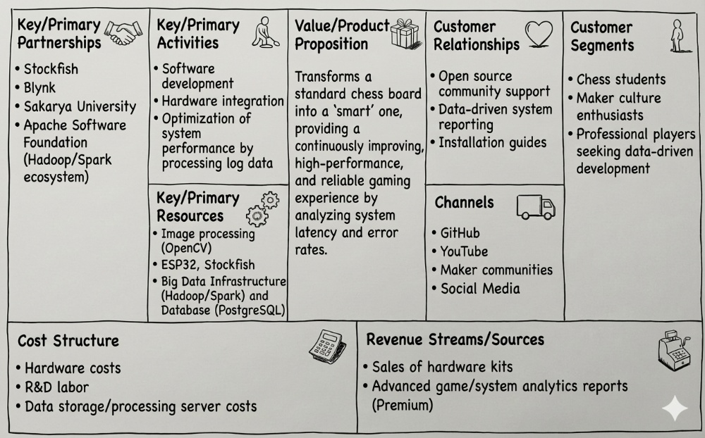

# IoT Smart Chessboard

An AI-powered physical chessboard that detects human moves using computer vision, calculates responses using the Stockfish engine, and visualizes moves directly on the board using an LED matrix.

## Project Overview

This system bridges the gap between physical and digital chess. It uses a camera to watch a real chessboard, processes the video feed to understand the game state, and communicates with an ESP32 microcontroller to light up LEDs on the board, guiding the player.

### Key Features
* **Computer Vision Move Detection:** Uses OpenCV to detect piece movements without requiring magnetic sensors or special pieces.
* **Stockfish Integration:** Calculates the best moves using the world's strongest open-source chess engine.
* **IoT Communication:** Uses Blynk to transmit move data instantly between the Python backend and the physical board.
* **LED Move Guidance:** The board lights up to confirm human moves and indicate the engine's response.
* **Motion Stability Check:** Advanced filtering ensures moves are only registered when the player's hand has left the board.

### Business Model Canvas
The following table outlines the business model for this project, detailing its value proposition, customer segments, and operational structure.



## Project Structure

The project is divided into two main directories:

### 1. `vision_part/` (The Brain)
Runs on a PC/Laptop. It handles:
* Capturing video from the camera (webcam or IP camera).
* Processing images to detect board state and chess moves.
* Running the Stockfish engine.
* Sending move commands to the IoT cloud.

### 2. `board_part/` (The Hardware)
Runs on an ESP32 microcontroller. It handles:
* Connecting to WiFi and the Blynk IoT cloud.
* Receiving move commands (e.g., "e2e4").
* Controlling the 8x8 LED matrix to light up the source and destination squares.

---

## Getting Started

### Prerequisites

**Hardware:**
* ESP32 Development Board
* 8x8 LED Matrix (or 64 individual LEDs wired in a matrix)
* Webcam or Smartphone (acting as an IP Camera)
* Physical Chessboard & Pieces

**Software:**
* Python 3.x
* Arduino IDE (for ESP32)
* Stockfish Engine Executable

---

### Installation & Setup

#### A. Vision Part (Python)

1. **Navigate to the folder:**

    ```bash
    cd vision_part
    ```

2. **Install dependencies:**

    ```bash
    pip install opencv-python numpy python-chess requests
    ```

3. **Configure `main.py`:**
   Open `main.py` and update the following variables at the top:
   * `BLYNK_AUTH`: Your Blynk Auth Token.
   * `CAMERA_URL`: The IP address of your camera (or `0` for USB webcam).
   * `STOCKFISH_PATH`: The absolute path to your downloaded `stockfish.exe`.

4. **Run the Brain:**

    ```bash
    python main.py
    ```

#### B. Board Part (ESP32)

1. **Open the Code:**
   Open `board_part.ino` in the Arduino IDE.

2. **Install Libraries:**
   Go to *Sketch > Include Library > Manage Libraries* and install:
   * `Blynk` by Volodymyr Shymanskyy
   * `WiFi` (Built-in for ESP32)

3. **Configure Credentials:**
   Update the top of the file with your details:

    ```cpp
    #define BLYNK_TEMPLATE_ID "YOUR_TEMPLATE_ID"
    #define BLYNK_DEVICE_NAME "SmartChess"
    #define BLYNK_AUTH_TOKEN "YOUR_AUTH_TOKEN" // Must match the one in Python
    char ssid[] = "YOUR_WIFI_NAME";
    char pass[] = "YOUR_WIFI_PASSWORD";
    ```

4. **Upload:**
   Connect your ESP32 via USB and upload the sketch.

---

## How to Play

1. **Power Up:** Plug in the ESP32. It will connect to WiFi.
2. **Start Vision:** Run the `main.py` script on your PC.
3. **Calibrate:**
   * A window will appear showing the camera feed.
   * Click the **4 corners** of the chessboard in order: Top-Left -> Top-Right -> Bottom-Right -> Bottom-Left.
4. **Tune (If needed):**
   * Use the sliders in the "Debug View" to adjust brightness/contrast thresholds until the green circles perfectly match the white pieces and pink circles match black pieces.
   * Press **SPACE** to start the game.
5. **Make a Move:**
   * Play a move as White.
   * The LEDs will light up to confirm your move.
   * Wait a moment...
   * The LEDs will then light up to show Stockfish's reply (Black).
6. **Your Turn:** Physically move the Black piece as instructed, then play your next move.

---

## Pin Mapping (ESP32)

This mapping assumes an 8x8 matrix where **Columns (Files)** are Anodes (+) and **Rows (Ranks)** are Cathodes (-).

| Chess File | ESP32 Pin | Chess Rank | ESP32 Pin |
| :--- | :--- | :--- | :--- |
| **File A** | GPIO 23 | **Rank 1** | GPIO 32 |
| **File B** | GPIO 22 | **Rank 2** | GPIO 33 |
| **File C** | GPIO 21 | **Rank 3** | GPIO 25 |
| **File D** | GPIO 19 | **Rank 4** | GPIO 26 |
| **File E** | GPIO 18 | **Rank 5** | GPIO 27 |
| **File F** | GPIO 17 | **Rank 6** | GPIO 14 |
| **File G** | GPIO 16 | **Rank 7** | GPIO 12 |
| **File H** | GPIO 4  | **Rank 8** | GPIO 13 |

---

*This project was developed as part of the IoT Project coursework for the 2025-26 Fall Semester, Department of Computer Engineering, Sakarya University.*